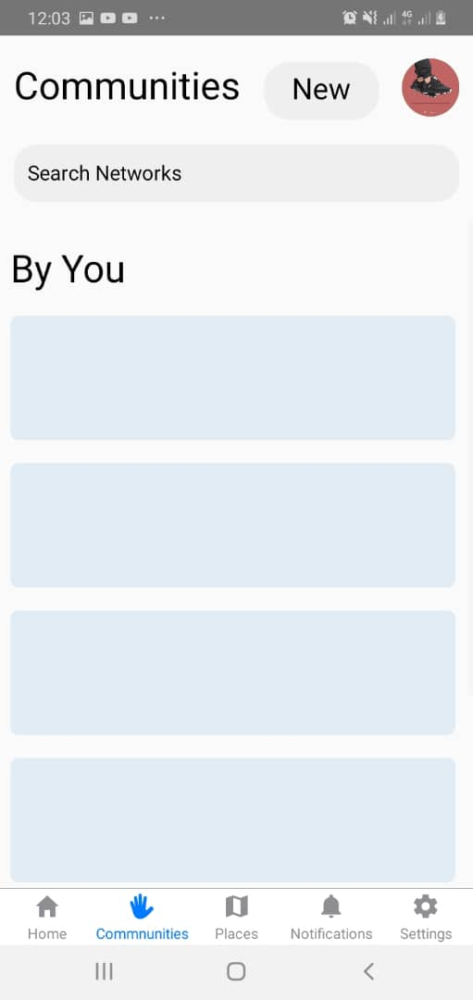

# **Besafe**

> Besafe is a platform to help people be safe on the way
## Screen Shots




## Main technologies used

- [React Native](https://github.com/facebook/react-native)

> A framework for building native apps with React.

- [Redux](http://redux.js.org/)

> Redux is a predictable state container for JavaScript apps.

> React Native Router based on new React Native Navigation API

## Running the project

- Clone this project
```
git clone https://github.com/amkayondo/besafe.git
```

- [Install NodeJS](https://nodejs.org/en/) on your computer.

- [Install yarn](https://yarnpkg.com/en/docs/install) on your computer
> Yarn is a dependency manager built by facebook and google. It is a more efficient and reliable (thanks to yarn.lock) alternative of npm.

- Launch ``` yarn ``` command in a terminal opened in the project folder.
> This command will look into the *package.json* file and install all the dependencies listed here.

- Install react-native-cli globally on your computer
```
yarn global add react-native-cli
```

### Android steps

- Launch a virtual android device [(through *Android Studio* for instance)](https://developer.android.com/studio/run/managing-avds.html#viewing)

> If you have never installed any android virtual device, [follow those instructions](https://developer.android.com/studio/run/managing-avds.html#createavd)

- Then, run the project in executing on your project folder:

```
react-native run-android
```

## Troubleshooting

**Note:** Each time you pull commits from others, run the **yarn** command to install dependencies that may have been introduced.

### react-native is not recognized as an internal or external command
- If your terminal is telling you react-native is not known, try to install it globally with npm: ```npm install -g react-native-cli``` and re-run the above command.

### 'adb' is not recognized as an internal or external command

If you have a build error with this message on Windows, it means that you must add the Android sdk platform tools to your environment PATH.

# **Author**

## **Kayondo Edward**

